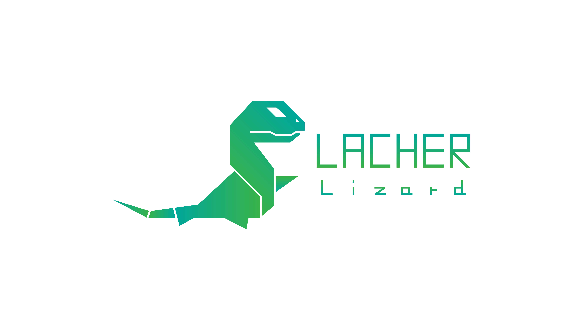

  

# Security Crawler

     

## About

_security crawler can crawling all urls of website by set in seed(website url), extract signature(pattern) each of them and choose uniqe signtures as target for penterate...at least you can test sql injection or xss for target urls...or you can improve it :)_

###### ✔ presentation slide in [ Slideshare ](https://www.slideshare.net/alifarhadian2/lacher-lizard)
###### ✔ for more Introduction , see Film in [ Youtbe ](https://www.youtube.com/watch?v=yYpAaOyJ2K0&t=9s)

  
  
## SIGN MEANS

_abc.com/news/123da224/%8c%4d../weather-middle-east => abc.com/news/randnum/encoded/title_

  
  
## FrameWorks & APPS

_crawler core written from bucky roberts Spider's (Most of it changed) and sql injection & xss testing with sqlmap and arachni scanner framworks_ 

  

_Spider_[ GitHub ](https://github.com/buckyroberts/Spider) 

_Sqlmap_[ GitHub ](http://sqlmap.org/) 

_Arachni_[ Site ](https://www.arachni-scanner.com/) 

  
  
  
## About US

*I'm **Ali Farhadian** who are responsible for coding of this Thesis project at **Urmia University of Technology** (UUT)_ 
This project is under the supervision of Dr. **Mir Saman Tajbakhsh**._ 
**Amir Goodarzi** is the designer of Lacher-Lizard's logo.*

* **Ali Farhadian** [ GitHub ](https://github.com/alifrd) 
* **Mir Saman Tajbakhsh** [ Personal Website ](https://mstajbakhsh.ir/) &nbsp;      [ GitHub ](https://github.com/mirsamantajbakhsh) 
* **Amir Goodarzi** [ Github ](https://github.com/AmirGoodarzi) 
* **Urmia University of Technology (UUT)** [ Website ](http://uut.ac.ir/) 
  
## How to Install

### step 1:
>download [ Arachni ](https://www.arachni-scanner.com/download/) framework's and move ***content*** of arachni_[sub version number] , in  ***/include/arachni/[move  here]*** dirctory
>
>Notice:
>>	you must have below directory: 
	./include/arachni/bin/... 
	./include/arachni/system/... 
	./include/arachni/LICENSE 
	.... 
	
### step 2:
>install [ sqlmap ](http://sqlmap.org/) in your pc

  
  
## Config file

_at ./config file in config.json_ 

* ProjectName : name of project 

* URL : url of project 

* Setting 

	* Mode : SLOW / FAST (explore repeated urls signutre or repeated signture) 

	* MiddleWare : NORMAL / PROXY / SOCKS (use my ip / proxy ip(in ./config/proxy.json) , each thread use one proxy that means you must set proxy in order to you'r setting threads / socks encrypte) 

	* SIGN : DEPTH / NORMAL (explore sing state tree) 

* ThreadNumber : number of threads 

* SQLMAP :  

	* manaul : for manual setting 

	* threads : sqlmap app threads 

	* timeout : time of app request , response timeout 

	* answer : auto answer question of app 

* XSS : 

	* path : path directory of arachni file 

	* manual : for manual setting 
    
    
**Ask and You Will learn [~Imam Ali]**
